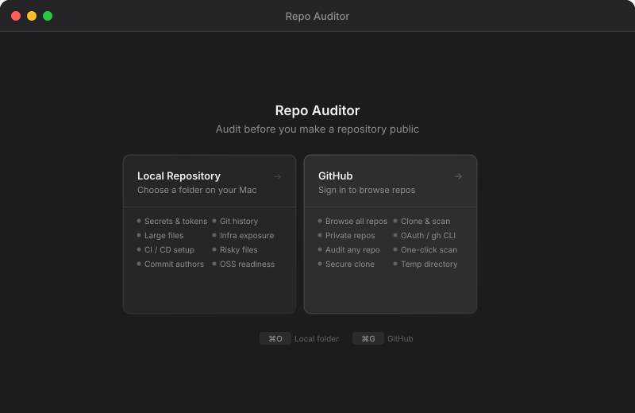
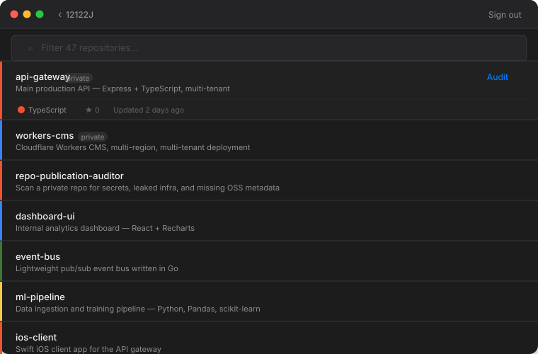
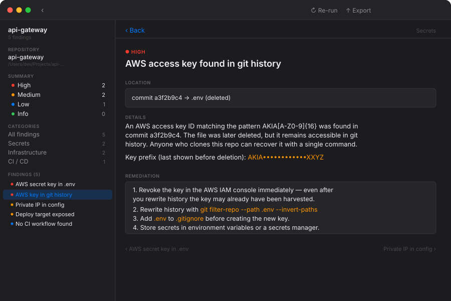

<div align="center">
  
  <br/><br/>
  <strong>Catch what you forgot before the world can see it.</strong>
  <br/><br/>
  <p>A native macOS app and CLI that scans a private repository for secrets, exposed infrastructure, personal data, and missing open-source hygiene — before you flip it public.</p>
  <br/>
  <a href="#installation"></a>
  
  
  
  <br/><br/>
</div>

---

### Welcome screen — choose a local folder or sign in to GitHub



### Browse and audit GitHub repositories directly



### Every finding explained — with remediation steps



---

## Why this tool?

When a private repo accumulates months or years of work, it tends to collect things you never intended to share: database URLs hardcoded during a weekend hack, an AWS key that's since been rotated but still lives in commit history, an nginx config that names a production server, a `.env` file that was gitignored late.

Tools like Gitleaks and TruffleHog are excellent CI guards for repos that are already public. This tool asks a different question: **is this specific repo actually ready to be made public right now?** It combines secret scanning with OSS readiness checks in a native macOS app that runs entirely on your machine — no data leaves your computer.

---

## What it checks

| Category | Findings |
|---|---|
| **Secrets** | API keys, tokens, passwords, and high-entropy strings in current files. Patterns cover AWS, GCP, GitHub, Stripe, Twilio, SendGrid, Slack, and generic bearer tokens. |
| **Git history** | Secrets committed and later deleted. They're gone from the working tree but still readable in any clone. Includes a summary of which commits and which patterns. |
| **Large files** | Files ≥ 5 MB (warning) and ≥ 20 MB (error). Large binaries bloat every future clone of the public repo. |
| **Risky files** | `.env`, `*.pem`, `*.p12`, `*.key`, database dumps (`.sql`, `.db`, `.sqlite`), personal documents, editor backup files, and similar. |
| **Infrastructure** | Deploy scripts, systemd units, nginx/Apache configs, Docker Compose files, Terraform state, internal IP addresses (`10.x`, `172.16–31.x`, `192.168.x`), and hostnames that look like internal servers. |
| **Git hygiene** | Personal email domains (gmail, icloud, yahoo, hotmail, etc.) in commit author history. Useful if you built something on personal time and don't want that associated with the project. |
| **CI / CD** | Missing `.github/workflows/`, `.gitignore`, `CONTRIBUTING.md`, `SECURITY.md`, `CHANGELOG`. These aren't blockers but open-source projects are expected to have them. |
| **OSS readiness** | Missing or near-empty `README`, missing `LICENSE`, missing `package.json` metadata fields (name, description, repository, author, license). |

Secret values are **never** included in reports — only file paths, line numbers, and the pattern that matched.

---

## Installation

### macOS app

Clone the repo and open in Xcode, or build from the terminal:

```bash
git clone https://github.com/12122J/repo-publication-auditor.git
cd repo-publication-auditor
./script/build_and_run.sh
```

**Requires macOS 14 Sonoma or later, Xcode 15+.**

### CLI

```bash
# Build a release binary
swift build -c release

# Run directly
.build/release/repo-auditor /path/to/repo
```

Or without building first:

```bash
swift run repo-auditor /path/to/repo
```

---

## Using the macOS app

### Local repository

Click **Local Repository** or press `⌘O`. A folder picker opens; select any git repository. The audit starts immediately.

Results appear in a split view:

- **Left sidebar** — severity breakdown, category filters, and a scrollable findings list. Click any category to filter. Click any finding to jump to its detail.
- **Top stat bar** — click a severity level to jump directly to the first finding of that severity.
- **Detail panel** — the selected finding's full description, location (file + line), and step-by-step remediation. Hover any row in the findings list for a quick remediation preview without leaving the list.

### GitHub repositories

Click **GitHub** or press `⌘G`. Sign in with either:

- **gh CLI** — if you have the [GitHub CLI](https://cli.github.com/) installed and already authenticated (`gh auth login`), the app picks up your token automatically with one tap.
- **Device flow OAuth** — the app opens GitHub's authorization page in your browser, shows the one-time code, and polls in the background. No server, no redirect URI needed.

Your repositories load in a filterable list sorted by last updated. Private repos are supported. Click **Audit** on any repo to clone it to a private temporary directory and run the full scan. The clone is deleted when you close or re-scan.

### Exporting a report

Click the **Export** button in the toolbar to save a Markdown report. The file includes every finding with full detail and remediation — useful to attach to an internal review or keep as a checklist.

---

## CLI usage

```
repo-auditor [path] [--output FILE] [--no-history] [--fail-on SEVERITY]

Options:
  path              Repository root directory (default: current directory)
  --output FILE     Write Markdown report to FILE instead of stdout
  --no-history      Skip git history scanning (faster for large repos with deep history)
  --fail-on LEVEL   Exit 1 if any finding matches this severity or higher
                    Values: high | medium | low | info
  --help            Show usage
```

### Exit codes

| Code | Meaning |
|---|---|
| `0` | Scan complete. No findings at or above the threshold (or no threshold set). |
| `1` | One or more findings at or above the `--fail-on` threshold. |
| `2` | Error — invalid path, unknown flag, etc. |

### Examples

```bash
# Audit current directory, print report to stdout
repo-auditor .

# Write report to a file
repo-auditor ~/Projects/my-private-api --output audit.md

# Skip history scanning (good for repos with thousands of commits)
repo-auditor . --no-history

# Fail CI if there are any high-severity findings
repo-auditor . --fail-on high

# Fail CI on anything above info (i.e. low, medium, or high)
repo-auditor . --fail-on low
```

---

## CI integration

The CLI is designed to slot into any pipeline. It exits `1` only when findings meet or exceed the threshold you set, so you control how strict the gate is.

### GitHub Actions

```yaml
jobs:
  audit:
    runs-on: macos-latest
    steps:
      - uses: actions/checkout@v4
        with:
          fetch-depth: 0          # needed for full history scan
      - name: Audit repository
        run: |
          swift run repo-auditor . --fail-on high --output audit-report.md
      - name: Upload audit report
        if: always()
        uses: actions/upload-artifact@v4
        with:
          name: audit-report
          path: audit-report.md
```

### GitLab CI

```yaml
audit:
  image: swift:5.10
  script:
    - swift run repo-auditor . --fail-on medium --output audit.md
  artifacts:
    paths: [audit.md]
    when: always
  allow_failure: false
```

### Pre-push hook

```bash
# .git/hooks/pre-push
#!/bin/sh
swift run repo-auditor . --fail-on high --no-history
```

---

## Architecture

The CLI and the macOS app share the same `AuditCore` library. Running `repo-auditor` from the terminal produces identical findings to running the app — there is no "lite" mode.

```
Sources/
  AuditCore/                  — shared scan engine
    RepositoryAuditor.swift   — orchestrates all scanners
    Models.swift              — Finding, Severity, FindingCategory, AuditReport
    MarkdownReportRenderer.swift
    SecretScanner.swift
    GitHistoryScanner.swift
    LargeFileScanner.swift
    RiskyFileScanner.swift
    InfrastructureScanner.swift
    CommitAuthorScanner.swift
    CISetupScanner.swift
    OSSReadinessScanner.swift

  RepoAuditorApp/             — native macOS app (SwiftUI, macOS 14+)
    App/
    Views/
    ViewModels/
    Services/                 — GitHubService (OAuth + REST), RepoCloner

  RepoAuditorCLI/             — command-line entry point
    main.swift

Tests/
  AuditCoreTests/
```

---

## Contributing

**Contributions are very welcome.** The codebase is intentionally small and adding a new scanner takes about 30 lines of Swift. If you've ever been burned by something slipping through before a repo went public, there's a good chance it would make a useful scanner here.

Some ideas that aren't built yet:

- **Dependency audit** — flag packages with known CVEs (`npm audit`, `pip-audit`, `cargo audit`)
- **Hardcoded URLs** — detect localhost, staging, and internal domain patterns
- **Binary detection** — warn about compiled binaries checked in rather than built by CI
- **Commit message quality** — flag repos where most commits are "fix", "update", "wip"
- **Branch hygiene** — many stale local-only branches pushed up, no default branch protection
- **GitHub Actions security** — `pull_request_target` without pin, mutable action refs

See [CONTRIBUTING.md](CONTRIBUTING.md) for how to add a scanner, the severity guide, and PR guidelines.

---

## Prior art

Inspired by [Gitleaks](https://github.com/gitleaks/gitleaks), [TruffleHog](https://github.com/trufflesecurity/trufflehog), [git-secrets](https://github.com/awslabs/git-secrets), [detect-secrets](https://github.com/Yelp/detect-secrets), and [OpenSSF Scorecard](https://github.com/ossf/scorecard). The focus here is narrower and more personal: a fast, offline, local-first tool for making a go/no-go decision before flipping the visibility switch.

---

## License

MIT
