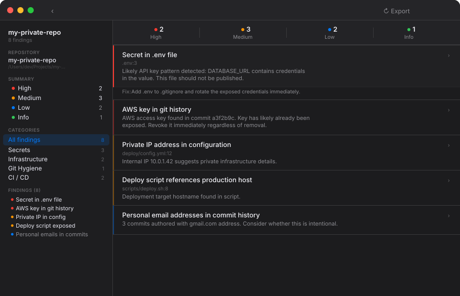

<div align="center">
  
  <br/>
  <p><strong>Audit private repositories before making them public.</strong></p>
  <p>A local-first macOS app and CLI that catches secrets, exposed infrastructure, and missing OSS metadata — before the world can see them.</p>
  <br/>
  
  
  
</div>

---

<div align="center">
  
  <br/><br/>
  
</div>

---

## What it checks

| Category | Checks |
|---|---|
| **Secrets** | API keys, tokens, passwords, and secret-like patterns in current files |
| **Git history** | Secrets committed and later deleted — still visible in history |
| **Large files** | Files over 5 MB (warning) and 20 MB (error) that bloat the public repo |
| **Risky files** | `.env`, private keys, certificates, database dumps, personal documents |
| **Infrastructure** | Deploy scripts, systemd units, nginx configs, Docker Compose, internal IPs and hostnames |
| **Git hygiene** | Personal email domains (gmail, icloud, etc.) found in commit author history |
| **CI / CD** | Missing `.github/workflows/`, `.gitignore`, `CONTRIBUTING.md`, `SECURITY.md`, `CHANGELOG` |
| **OSS readiness** | Missing `LICENSE`, missing or stub `README`, incomplete `package.json` metadata |

Secret values are **never** printed in reports — only the file path and line number.

---

## macOS app

### Build and run

```bash
# Open in Xcode
open repo-publication-auditor.xcodeproj

# Or build and run from the command line
./script/build_and_run.sh
```

**Requirements:** macOS 14 Sonoma or later, Xcode 15+.

### Local repository

Click **Local Repository** (or press `⌘O`) to choose any folder. The audit runs immediately and results appear in the split view.

### GitHub repositories

Click **GitHub** (or press `⌘G`). Sign in with:

- **gh CLI** — if you have the [GitHub CLI](https://cli.github.com/) installed and authenticated, the app picks up your token automatically with one tap.
- **OAuth** — the app starts a device flow, opens your browser to GitHub's authorization page, and polls in the background. No server or callback URL needed.

Once signed in, your repositories are listed with language, star count, and last-updated time. Click **Audit** on any repo to clone it privately to a temporary directory and scan it.

---

## CLI

```bash
# Build
swift build -c release

# Run
.build/release/repo-auditor [path] [options]
```

Or via `swift run` without building first:

```bash
swift run repo-auditor /path/to/repo
```

### Options

| Flag | Description |
|---|---|
| `[path]` | Repository root (default: `.`) |
| `--output <file>` | Write Markdown report to a file instead of stdout |
| `--no-history` | Skip git history scanning (faster for large repos) |
| `--fail-on <severity>` | Exit with code `1` if findings at this level or higher exist |
| `--help` | Show usage |

`--fail-on` accepts: `high`, `medium`, `low`, `info`

### Exit codes

| Code | Meaning |
|---|---|
| `0` | Scan complete, no findings at or above the threshold |
| `1` | One or more findings at or above `--fail-on` threshold |
| `2` | Error (invalid path, unknown flag, etc.) |

### Examples

```bash
# Audit current directory, print to stdout
repo-auditor .

# Write report to file
repo-auditor ~/Projects/my-repo --output OPEN_SOURCE_AUDIT.md

# Skip git history (useful for very large repos)
repo-auditor . --no-history

# Fail CI on any high-severity finding
repo-auditor . --fail-on high
```

---

## CI integration

Add a step to your pipeline to gate on severity. The CLI exits `1` only when findings match or exceed the threshold, so `info` findings never block a release unless you opt in.

**GitHub Actions**

```yaml
- name: Audit before publishing
  run: |
    swift run repo-auditor . --fail-on high --output audit-report.md
- name: Upload audit report
  if: always()
  uses: actions/upload-artifact@v4
  with:
    name: audit-report
    path: audit-report.md
```

**GitLab CI**

```yaml
audit:
  script:
    - swift run repo-auditor . --fail-on medium --output gl-audit.md
  artifacts:
    paths: [gl-audit.md]
    when: always
```

---

## Project structure

```
Sources/
  AuditCore/          — Scan engine (used by both app and CLI)
    RepositoryAuditor.swift
    Scanners/         — One scanner per concern
    Models.swift
    MarkdownReportRenderer.swift
  RepoAuditorApp/     — SwiftUI macOS app
    App/
    Views/
    ViewModels/
    Services/         — GitHubService, RepoCloner
  RepoAuditorCLI/     — Command-line entry point
    main.swift
Tests/
  AuditCoreTests/
```

The CLI and the macOS app share the same `AuditCore` package. Running the CLI is equivalent to running the app's scan engine — same findings, same report.

---

## Prior art

Inspired by [Gitleaks](https://github.com/gitleaks/gitleaks), [TruffleHog](https://github.com/trufflesecurity/trufflehog), [git-secrets](https://github.com/awslabs/git-secrets), and [OpenSSF Scorecard](https://github.com/ossf/scorecard). The focus here is narrower: a fast, private, local-first tool for deciding whether *your specific repo* is ready to go public — not a CI secret scanner for an already-public project.

---

## License

MIT
